# Draw.io Neural Network Model Library

A collection of **37 ready-to-use neural network architecture templates** for [draw.io](https://app.diagrams.net/), designed for academic papers, technical reports, and presentations. All diagrams follow IEEE Transactions color conventions with a consistent, professional style.

## How to Use

Open `nn_model_library.xml` in draw.io (File > Open Library) to load all 37 templates into the scratchpad. Drag any template onto your canvas and customize as needed.

Alternatively, individual `.drawio` files are available in `exports/drawio/` for standalone use.

## Preview

### CNN Architectures

<table>
<tr>
<td align="center"><b>LeNet-5</b></td>
<td align="center"><b>ResNet Block</b></td>
<td align="center"><b>MobileNet Block</b></td>
<td align="center"><b>Inception Module</b></td>
</tr>
<tr>
<td>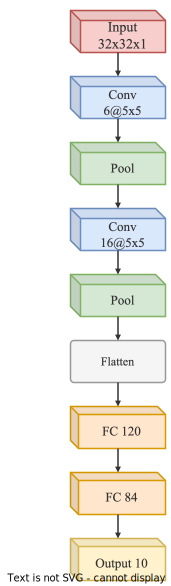</td>
<td>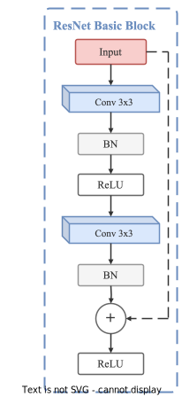</td>
<td>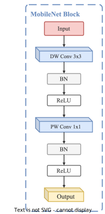</td>
<td>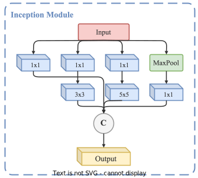</td>
</tr>
</table>

### Transformer Architectures

<table>
<tr>
<td align="center"><b>Vision Transformer (ViT)</b></td>
<td align="center"><b>Transformer Encoder</b></td>
<td align="center"><b>Swin Transformer Block</b></td>
</tr>
<tr>
<td>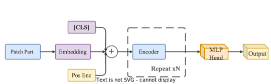</td>
<td>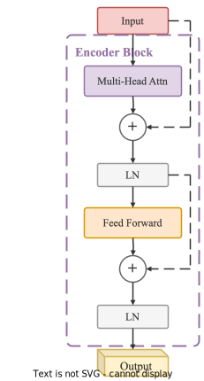</td>
<td>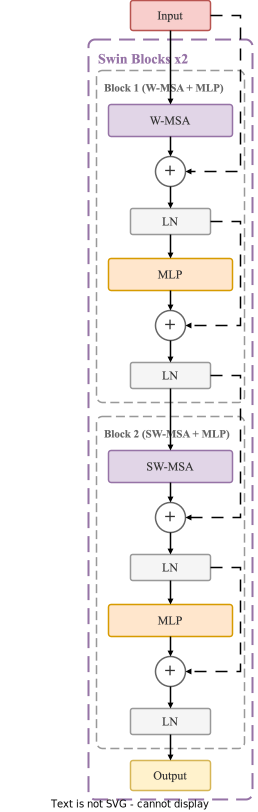</td>
</tr>
</table>

### Sequence Models

<table>
<tr>
<td align="center"><b>Seq2Seq + Attention</b></td>
<td align="center"><b>BERT Block</b></td>
<td align="center"><b>GPT Block</b></td>
</tr>
<tr>
<td>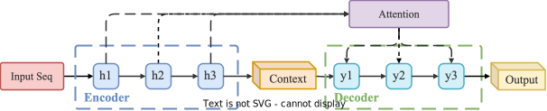</td>
<td>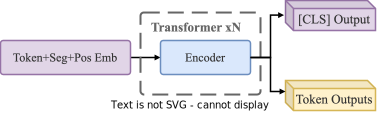</td>
<td>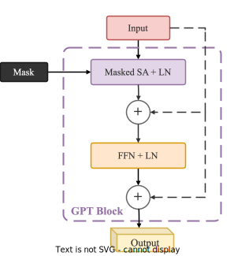</td>
</tr>
</table>

### Detection & Segmentation

<table>
<tr>
<td align="center"><b>U-Net</b></td>
<td align="center"><b>Faster R-CNN</b></td>
</tr>
<tr>
<td>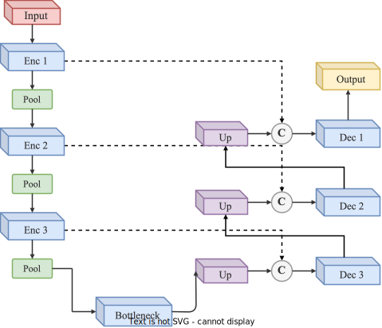</td>
<td>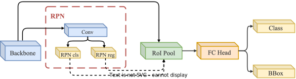</td>
</tr>
</table>

## Full Template List (37 Models)

**CNNs:** LeNet-5, AlexNet, VGG Block, ResNet Block, ResNet Bottleneck, DenseNet Block, MobileNet Block, EfficientNet MBConv, Inception Module

**Transformers:** Transformer Encoder, Transformer Decoder, Full Transformer, ViT, Swin Transformer Block, Multi-Head Attention Detail, MLP-Mixer

**NLP Models:** BERT Block, GPT Block, Seq2Seq, Seq2Seq + Attention

**RNNs:** Stacked LSTM, Stacked GRU, Bi-LSTM

**Detection & Segmentation:** Faster R-CNN, FPN, YOLO Head, U-Net, FCN Decoder, ASPP Module

**Generative Models:** GAN, DCGAN Generator, DCGAN Discriminator, Conditional GAN, VAE, Autoencoder

**Other:** GAT Layer, Siamese Network

## Color Scheme

All templates use a standardized IEEE Transactions academic color palette.

| Component | Fill | Stroke |
|-----------|------|--------|
| Attention | `#E1D5E7` | `#9673A6` |
| Convolution | `#DAE8FC` | `#6C8EBF` |
| Deconvolution | `#DCEEF8` | `#56A5C9` |
| RNN (LSTM/GRU) | `#D4EDDA` | `#28A745` |
| Pooling | `#D5E8D4` | `#82B366` |
| Normalization | `#F5F5F5` | `#999999` |
| FC / MLP | `#FFE6CC` | `#D79B00` |
| Input | `#F8CECC` | `#B85450` |
| Output | `#FFF2CC` | `#D6B656` |
| Operators | `#FFFFFF` | `#666666` |

## License

This library is provided under the [MIT License](LICENSE). Feel free to use these templates in your papers, presentations, and projects.
